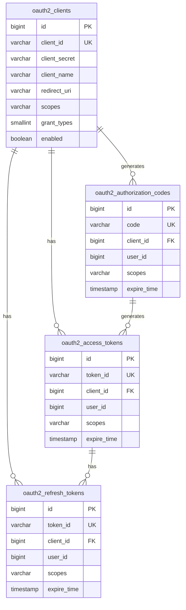
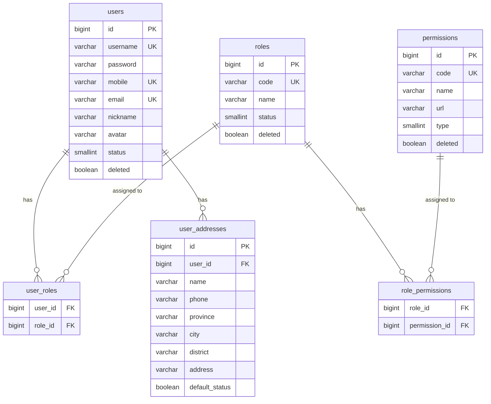
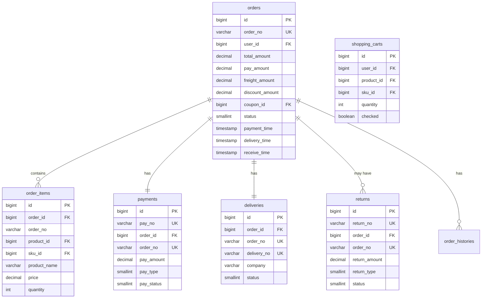
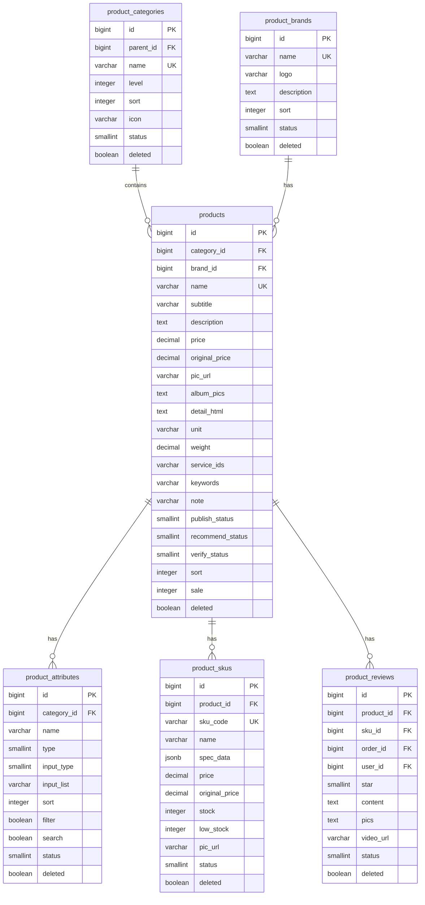
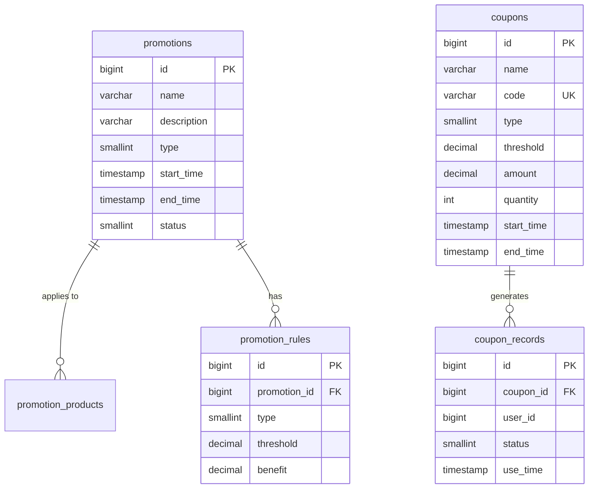
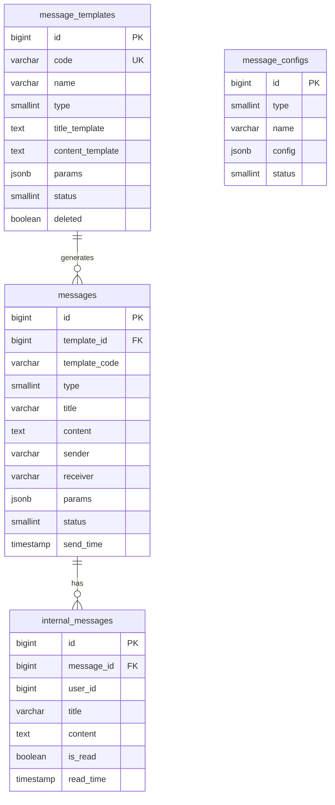
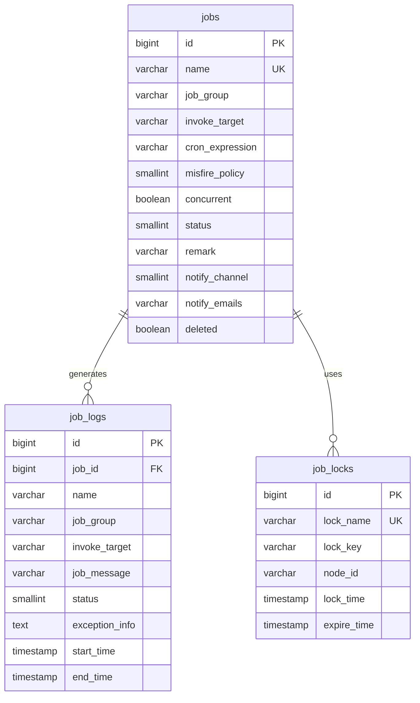

# 微服务数据库设计文档

本文档描述了微服务架构中各个服务的数据库表结构设计及其关系。

## 目录
- [认证服务(cloud-auth)](#认证服务)
- [用户服务(cloud-user)](#用户服务)
- [订单服务(cloud-order)](#订单服务)
- [商品服务(cloud-product)](#商品服务)
- [促销服务(cloud-promotion)](#促销服务)
- [消息服务(cloud-message)](#消息服务)
- [任务调度服务(cloud-job)](#任务调度服务)

## 认证服务

认证服务负责处理系统的认证和授权功能，实现了 OAuth2 协议。

## 用户服务

用户服务管理系统用户、角色和权限信息。

## 订单服务

订单服务处理购物车、订单、支付和物流等功能。

## 商品服务

商品服务管理商品分类、品牌、商品和 SKU 信息。

## 促销服务

促销服务管理优惠券、促销活动等营销功能。

## 消息服务

消息服务处理系统通知、短信、邮件等消息发送功能。

## 任务调度服务

任务调度服务管理系统中的定时任务和批处理作业。

## 设计说明

1. **主键设计**
   - 所有表使用 BIGSERIAL 类型的自增主键
   - 主键名统一为 id

2. **时间字段设计**
   - 使用 TIMESTAMP WITH TIME ZONE 类型存储时间
   - 创建时间字段名为 create_time
   - 更新时间字段名为 update_time

3. **软删除设计**
   - 使用 deleted 布尔字段标记删除状态
   - 默认值为 FALSE

4. **乐观锁设计**
   - 使用 version 整型字段实现乐观锁
   - 默认值为 0

5. **唯一约束设计**
   - 业务唯一字段都添加了唯一约束
   - 支持软删除的表的唯一约束会包含 WHERE deleted = FALSE 条件

6. **索引设计**
   - 对常用查询字段创建了索引
   - 创建索引时考虑了查询效率和维护成本的平衡

7. **字段注释**
   - 所有字段都添加了中文注释
   - 对于枚举值的字段，在注释中说明了每个值的含义

8. **微服务解耦**
   - 各个服务都使用独立的数据库
   - 服务间通过 ID 引用，不使用外键约束
   - 保持数据一致性通过应用层实现
